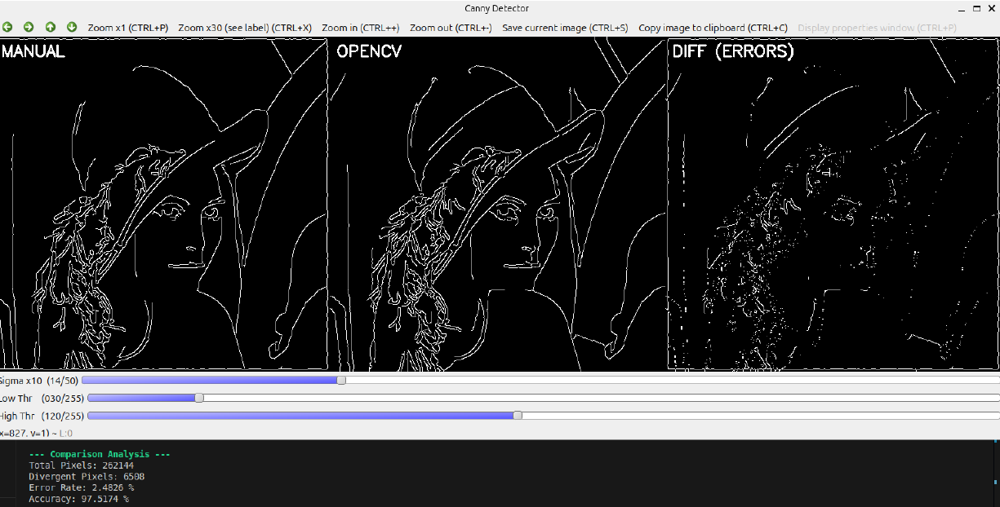

# Canny-Edge-Detector-From-Scratch
**Author:** Kevin KUZU (xkuzuke00)  
**Course:** Image Processing (ZPOe)  
**Academic Year:** 2025/2026

## Project Overview
This repository contains a full, native implementation of the **Canny Edge Detection pipeline** written in **C++** from scratch. Developed as part of the **Image Processing** course at the **Brno University of Technology**, this software extracts high-fidelity structural contours from images without relying on heavy external computer vision libraries.

OpenCV was strictly confined to basic Image Input/Output operations and UI display infrastructure, ensuring that all core mathematical operations—from raw pixel convolutions to continuous edge tracing—were designed and implemented manually.

  

---

## 1. System Requirements
* **Libraries:** OpenCV 4.5.4, Zenity 

## 2. Build and Execution
### Building the project
To compile the source code, use the provided Makefile:

make

# Then

LD_PRELOAD=/lib/x86_64-linux-gnu/libpthread.so.0 ./canny_proj
